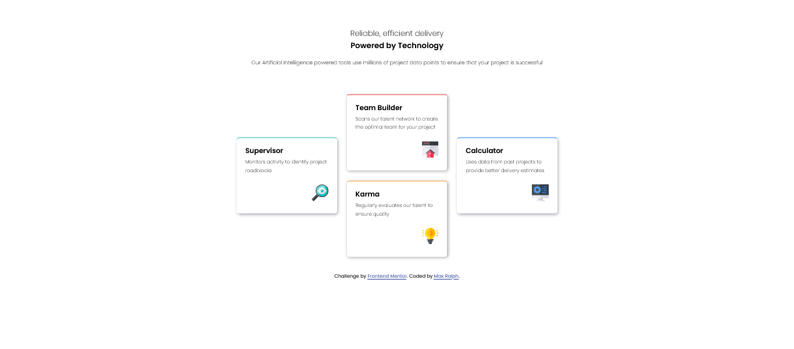

# Hi, Max Ralph here 👋

**Full-stack software engineer**.

I architect (plan and design) and build api and web applications from the ground up. I pay utmost, great attention to details and creating very secure, high-performing, scalable and attractive-looking applications.

Most importantly, I write comprehensive tests for my applications. And my API documentations are thoroughly prepared.

My frontend web pages/applications are witten with responsiveness at the forefront.

I am at the stage in my career where I know exactly what every single line of code I write does. No guesses or magic here. And I can read and basically have a clue of what another line of code is saying to me in almost any programming language (object-oriented or functional) I am yet to try.

I can debug anything in these languages and frameworks I use.

In all, I do not simply code, I program systems.

Please, schedule a conversation with me to confirm these for yourself.

     &nbsp; &nbsp;
     &nbsp; &nbsp;
     &nbsp; &nbsp;
     
    E-mail: <a href="" mailto="maxralph01@gmail.com">maxralph01@gmail.com
    </a> &nbsp;

 
 

    

        <h4>Optional: More about Max Ralph's Programming Journey (my struggles, how I overcame them and how I got here today)</h4>
    

This is a long, but interesting read if you like catchy life stories. I skipped some parts to make it shorter than it would have been.

I learnt about programming in 2007. I started programming in 2018. In 2019, I became very serious about it.

I have taken my time for years (since 2019), step-by-step to hone my skills. Throughout this build-up (preparatory) phase, I did not apply to jobs. Now, I am ready to be employed. By hiring me, you are assured of very high quality software.

I went through the perilous path of "self-taught".

First in 2007, I got my first laptop. I learnt about Python. I installed Python 2. But unfortunately, I did not know my way around it. I downloaded free books online, but could not make sense of any of it.

Later on, I learnt about Ruby. The red color drew me in. I downloaded a free e-book again on it. I would say I made extra progress than I had previously done with Python manuals, because I started understanding the steps. But in the end, I could not produce anything yet from all I had read. I dropped programming.

Later on in 2017, I learnt about Node.JS. I bought an online course on it. But I never opened it, unfortunately, because I had financial struggles I needed to tackle and had less free time to study.

Finally, in 2018, I decided to be really serious about it all. I downloaded another e-book, "HTML & CSS Design and Build Websites by Jon Duckett". This book gave me my first productive application (web pages).

I was using Atom, Sublime Text. No VS Code then and other IDEs that weren't mainstream. They got the job done.

Impressed by this feat I had achieved from this book, I went ahead and downloaded another e-book from the same author, but this time on JavaScript, "JavaScript and JQuery interactive front-end web development". JavaScript and JQuery sank in a bit. But did not yield the desired result.

I even tried the book, "Eloquent JavaScript by Marijn Haverbeke". This book helped me a bit. But I was still largely unproductive with JavaScript.

I was frustrated by how JavaScript did me. So, I kept searching and searching until in 2019, I found Google's MaterializeCSS. Materialize was a game changer for me as I was finally able to build presentable web pages with sprinkles of JavaScript.
My JavaScript worries had finally been solved!

And so, I decided never ever ever ever lol to touch JavaScript and ever again (I made it a point of duty), since I could use Materialize with its sprinkles of JS. Little did I know I would love JavaScript more than everything else later down the road.

So, I looked up PHP. I started experimenting with it as well (I used w3school.com). I found so many books. I read.

I learnt about frameworks that just like Materialize was for CSS, there were frameworks for programming languages. Zend Framework entered the room.

So, at this point, I had Zend and Materialize. I could build working pages. I chose Zend because it was presented as a framework that could build enterprise applications. And that Laravel was not as secure as it is. What did I know, I was teaching myself.

Unfortunately, the unexpected happened. Google announced they had decided to stop maintaining MaterializeCSS. Zend on the other hand stopped maintaining the framework for whatever reason.

The 2 technologies I knew had been decimated. I was demoralized. This taught me for the first time, the importance of learning the underlying technologies for frameworks.

I had to start afresh again. I learnt Bootstrap, which I had previously rejected as I was of the opinion that Google was stronger than Twitter and whatever technologies they both had would mirror their strengths. I guess I was wrong, afterall.

I also needed to replace Zend. I started to learn vanilla PHP again. And luckily, I thought to myself to try out the Laravel I had earlier rejected in favor of the more "robust" Zend. I could not get something productive until I saw on YouTube, Brad Traversy's Laravel 5.8 course. This video series were a gamechanger for me.

Once more, I had Bootstrap (for CSS and JavaScript) and Laravel (for PHP) again up my sleeves. I could build anything.

Tailwind started getting popular. I wasn't having it then. It was too long (the classes) and complicated for me.

Learnt basics of Python and I added Django framework to my list.

I stuck with Laravel and Bootstrap until I started encountering issues that required knowledge of the underlying technologies. I realized I needed to learn these languages that powered these frameworks.

I started with PHP. Then, Python.

In 2021, I learnt of MDN website and its powers (this made me as versed as I am today).

From MDN, I polished my HTML, CSS skills. MDN demystified the once scary JavaScript. And they made me love JavaScript so much that I would go into any interview with JavaScript as my preferred language. Once most scary to now most loved. Unimaginable!

I added Node.JS. I revised and updated my Django skills to include testing.

And I decided to touch some functional programming. I have been experimenting with Elixir and its Phoenix framework as it is being presented as more approachable than Haskell.

Later on, with the vanilla CSS skills I had obtained from MDN, the once scary TailwindCSS was just like plain old CSS, I got to realize to my amazement.

And here we are today with the skills I have. Battle-tested and ready to debug anything (my StackOverflow profile can probably attest to this) on my own.

---

## Human Languages

I speak English,
Je parle français et
Ich spreche Deutsch

---

## Programming Languages, Frameworks and Tools

     &nbsp; &nbsp;
     &nbsp; &nbsp;
     &nbsp; &nbsp;
     &nbsp; &nbsp;
     &nbsp; &nbsp;
     &nbsp; &nbsp;
     &nbsp; &nbsp;
     &nbsp; &nbsp;
    <!--  -->
     &nbsp; &nbsp;
     &nbsp; &nbsp;
     &nbsp; &nbsp;
     &nbsp; &nbsp;
     &nbsp; &nbsp;
     &nbsp; &nbsp;
     &nbsp; &nbsp;
     &nbsp; &nbsp;
     &nbsp; &nbsp;
     &nbsp; &nbsp;
     &nbsp; &nbsp;
          

---

## Some Projects

BlogySocial blog and social media application.

The app is crafted in Django and Bootstrap with flavors of JavaScript.

[Link to repository](https://github.com/maxralph1/blogy)

---

<!-- BlogySocial blog and social media application. -->

<!-- The app is crafted in Django and Bootstrap with flavors of JavaScript. -->

<!-- [Link to repository](https://github.com/maxralph1/blogy) -->

<!--  -->

    <h4>Optional: More Projects</h4>

Check out the API projects I have pinned (the pinned apps section) here on my GitHub profile. They are well-documentated (proper documentations (both for online and offline viewers)), have well illustrated (digrammatic representations of) database schema and app descriptions (descriptive write-ups for both the layman and technical users) on what these applications entail and how to go about using them.

[Click to scroll](#pinned-projects)

---

## Some Frontend Code Challenges (coutesy: frontendmentor.io)

Social Proof Section challenge using flex, mobile-first approach, no grid.

[Link to repository ](https://github.com/maxralph1/social-proof-section) &nbsp;&nbsp; [Live Website ](https://social-proof-section-xi-eosin.vercel.app/)

---

Four Card Feature Section challenge using flex, grid and mobile-first work-flow.

[Link to repository ](https://github.com/maxralph1/four-card-feature-section) &nbsp;&nbsp; [Live Website ](https://four-card-feature-section-nu-jet.vercel.app/)

---

NFT Preview Card Component using flexbox.

[Link to repository ](https://github.com/maxralph1/nft-preview-card-component) &nbsp;&nbsp; [Live Website ](https://nft-preview-card-component-maxralph1.vercel.app/)

---

Clipboard landing page utilizing scss, flexbox, grid, mobile-first approach.

[Link to repository ](https://github.com/maxralph1/clipboard-landing-page) &nbsp;&nbsp; [Live Website ](https://clipboard-landing-page-virid-chi.vercel.app/)

<!-- 

    <h4>Optional: More frontendmentor.io Code Challenges</h4>

This Web.

[Live Website ](https://www.python.org/downloads/)

---

This Web.

[Live Website ](https://www.python.org/downloads/)

---

This Web.

[Live Website ](https://www.python.org/downloads/)

---

This Web.

[Live Website ](https://www.python.org/downloads/)

---

This Web.

[Live Website ](https://www.python.org/downloads/)

---

This Web.

[Live Website ](https://www.python.org/downloads/)

---

This Web.

[Live Website ](https://www.python.org/downloads/)

 -->

---

## Pinned Projects
